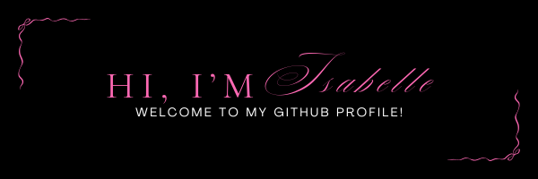

  

  
  <h1>Hi, I'm Isabelle Borges. Welcome!💗</h1>

  <b>Learning today, building tomorrow...</b>

---

## - About Me

* 🎓 **Systems Development student at SENAI — 2nd semester**
* 💡 **Curious and passionate about the technology field**
* 🤖 **Actively participated in the robotics team**
* 🚀 **Future Full Stack Developer**
* 🎯 **Always seeking to learn and grow**
* 🩷 [Access my portfolio!](https://isabelleborges26.github.io/)

</td>
<td width="45%" align="center">

</td>
</tr>
</table>

---
## - GitHub Dashboard

 

  
  

---
## - Technology Stack

  
  
  
  
  
  

---
<h3 align="center"> Thanks for visiting my profile! 💗 </h3>
